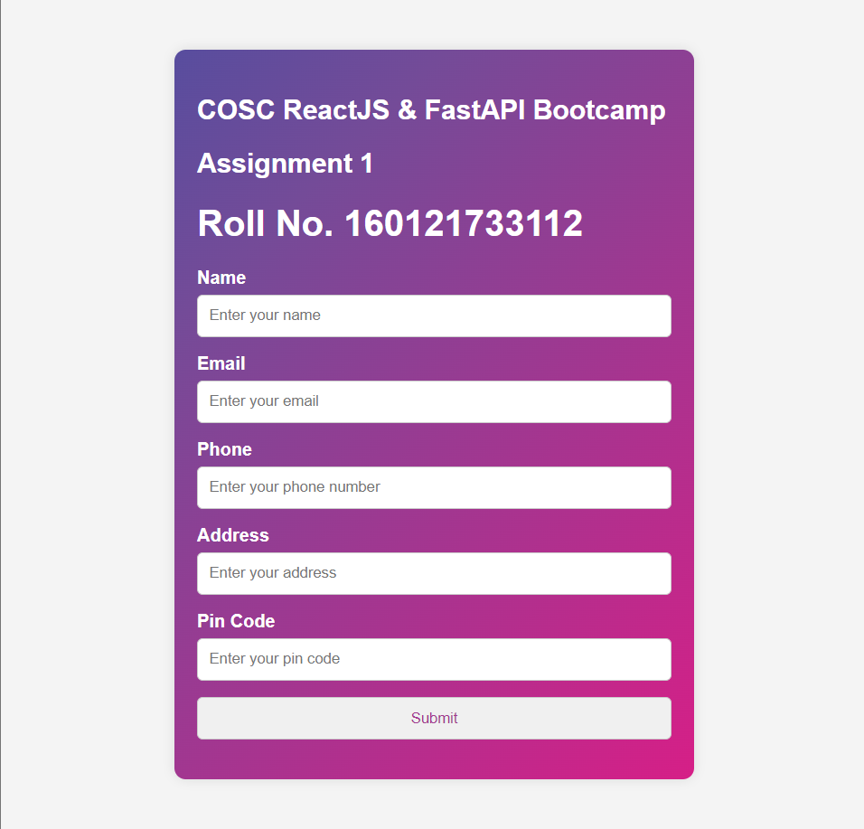
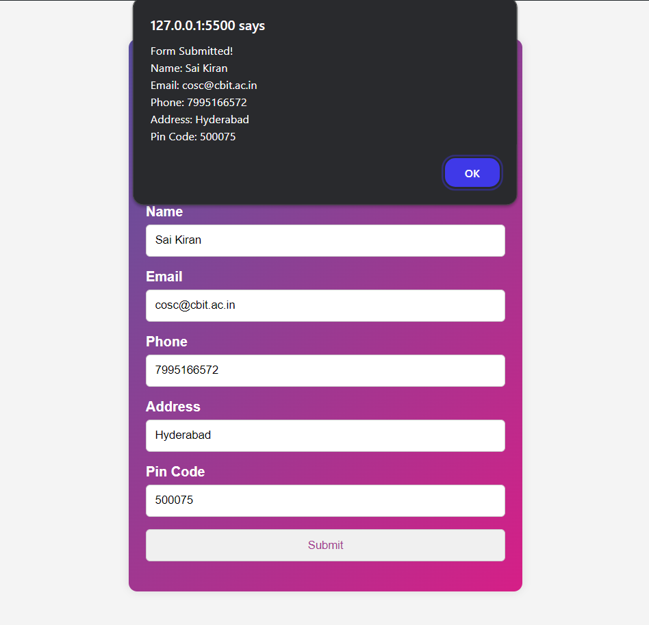

# Assignment 1: Form Enhancement

## Overview

In this assignment, you'll be working on enhancing a basic form that collects user information. The form currently consists of fields for the user's name. Your task is to expand its functionality and improve its visual design. Below are the specific tasks you need to complete.

## Objectives

Enhance your understanding of HTML, CSS, and JavaScript by building and styling forms, handling user inputs, and managing form submissions. Apply core HTML elements, CSS styling techniques, and JavaScript functionalities to create an interactive web form.

<h2>Tasks</h2>

 
<ul>
<li>Copy the index.html file and make the changes mentioned below. Note that all modifications must be done using only HTML, CSS, and JavaScript, and should be contained within the same file.</li>
<li><h3>1. Add Roll Number:</h3> Display a hardcoded Roll Number on the form.</li>
<li><h3>2. Add Additional Fields:</h3> Enhance the form by adding the following input fields:

-   **Email**: A field to collect the user's email address.
-   **Phone**: A field to collect the user's phone number.
-   **Address**: A multi-line text area to collect the user's address.
-   **Pincode**: A field to collect the user's pincode.

    Ensure that these fields are appropriately labeled and aligned with the existing design.

</li>
<li><h3>3. Change Input Label Styling: </h3>The labels for the input fields are currently displayed in black. Modify the styling so that all input labels are displayed in white color and are bolded.</li>
<li><h3>4. Display Form Values on Submission: </h3>On form submission, display all the values entered by the user (Name, Email, Phone, Address, Pincode) in the form of an alert box. This will allow you to verify that all input fields are working correctly and that the data is being captured as expected.</li>
</ul>

<h2>Expected outputs</h2>

  
  

<h2>Submission Process</h2>

 
<ul>
<li><h3>1. Test Your Form:</h3> Ensure that your form is functional and visually appealing. Test the form thoroughly to make sure that all fields are capturing data correctly and that the alert box displays all the information accurately upon submission.</li>

<li><h3>2. Submit Completed Code:</h3> Go to <a href="https://drive.google.com/drive/folders/13ZtaSoDDzGheYV5kjzrZADt5QJ_6bP_w?usp=drive_link">this link</a> and upload your code and output screenshot to the folder named after your roll number.</li>

<li><h3>3. Finish The Task:</h3> Fill <a href="https://forms.gle/A6tJ7J1RpBrA7WQA8">this Google Form</a> to finish the task.</li>

</ul>

## Deadline

**22 August 2024**

By completing this assignment, you will gain experience in enhancing forms, handling form submissions, and making basic UI design adjustments. And as always, may the source be with you!
