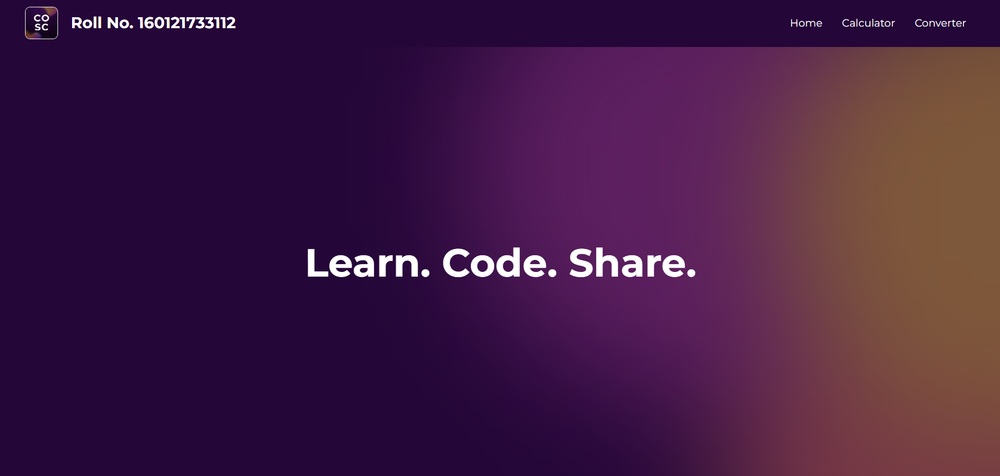
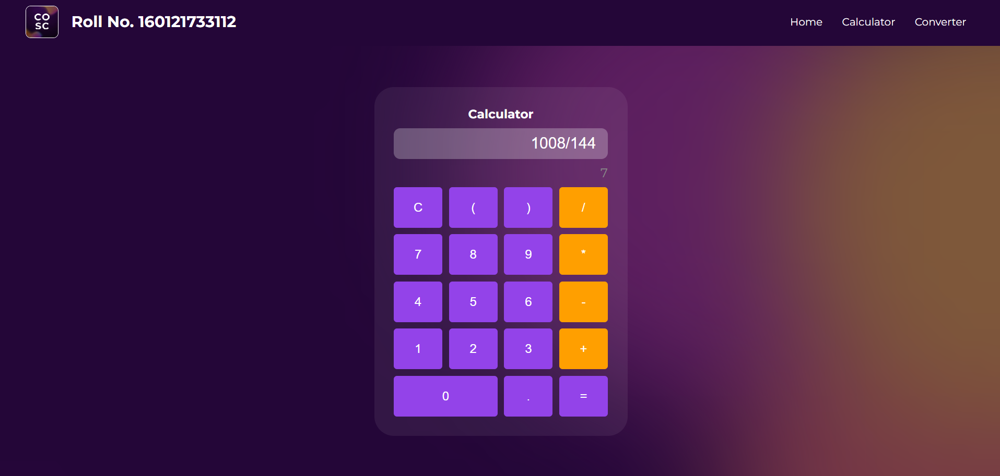

# Assignment 2: React Utility Suite

## Objectives

-   **Enhance your understanding of JavaScript and React** through debugging and altering a project to ensure expected functionality.
-   Gain experience **managing routes** and extending component functionality.
-   Apply core React concepts, such as **state management** to create an interactive and user-friendly web application all while getting practical experience.
-   Strengthen your ability to **implement and improve component logic**, focusing on practical applications of **React hooks** and JavaScript functionalities.

## Overview

In this assignment, you will work on a React-based utility suite web application, focusing on component routing, state management using hooks, and adding expected functionality to existing boilerplate. Your task is to make the calculator functional, implement routing to the temperature converter, and then improve their functionality. You will set up navigation between different pages and manage state effectively using React hooks. This project will deepen your understanding of React, particularly in the areas of hooks and routing, which are essential for building dynamic and interactive web applications.

<details open>
<summary><h2>Tasks</h2></summary>
<br>

<ul>
<li>
<h3>Repository Setup:</h3>

Download or clone the repository and work on the assigned tasks. Ensure that all modifications are made within the provided files.

https://github.com/user-attachments/assets/ba270fd9-c431-4e0f-ad74-0dc119467c75

-   [Click here](https://github.com/cbitosc/ReactJS-and-FastAPI-Bootcamp-Assignments/archive/refs/heads/main.zip) to download the zip file of the assignments.
-   Extract the repository once it is downloaded.
-   Open Visual Studio Code and open the Assignment-2 folder in it.

Once your folder is open in VS Code, open a new terminal and make sure you are in the Assignment-2 directory. Then, execute the following command to install the dependencies:

```
npm install
```

Subsequently, start the development server using the command:

```
npm run dev
```

</li>

<li><h3>1. Add Roll Number:</h3> Display a hardcoded Roll Number in the Navbar</li>
<li><h3>2. Add routing for temperature conversion page:</h3>

-   **2.1**: Add a route for TemperatureConverter Page in App.jsx
-   **2.2**: Add a link for Temperature converter component in Navbar component

</li>
<li><h3>3. Changes to Calculator: </h3>

-   **3.1**: Add functionality to the handleClick function. It should append the newly clicked value to the previous value.
-   **3.2**: Add functionality to the Evaluate function to compute the result.
-   **3.3**: Update the result state automatically whenever the input state changes.
</li>

<li><h3>4. Changes to Temperature Converter: </h3>

-   **4.1**: Create a select component for outputUnit similar to the inputUnit select component.
-   **4.2**: Compute the convertedTemp for all the different cases
-   **4.3**: Add a prop to TempConvertButton component to display the outputUnit
-   **4.4**: Pass outputUnit as a prop to TempConvertButton
-   **4.5**: Update the converted temperature automatically whenever inputTemp or inputUnit or outputUnit changes.
</li>
</ul>
</details>

<hr>

<details>
<summary><h2>Expected outputs</h2></summary>
<p align="center">
  
  
  
</p>
</details>

<hr>

<details>
<summary><h2>Submission Process</h2></summary>
<br>
<ul>
<li><h3>1. Test Your Application:</h3>

Ensure that each feature in your application is implemented correctly and functions as expected. Verify that the Roll Number displays in the Navbar, and that routing to the Temperature Conversion page works seamlessly. Test the Calculator to confirm that values are appended correctly, results are computed accurately, and updates occur automatically. Similarly, validate the Temperature Converter to ensure that unit selections, conversions, and automatic updates are handled correctly. Thoroughly test the entire application to confirm that all tasks are functioning smoothly.</li>

<li><h3>2. Submit Completed Code:</h3>

Go to <a href="https://drive.google.com/drive/folders/1Rls1-f5SSUDwPwgQlPy0maW_NrEFucpJ">this link</a> and upload your **src** folder and output screenshots to the folder named after your roll number.</li>

<li><h3>3. Finish The Task:</h3>

Fill <a href="https://forms.gle/SHS2XcjCNtVQ72Sz7">this Google Form</a> to finish the task.</li>

</ul>
</details>

## Deadline

**22 August 2024**

By completing this assignment, you will gain experience in enhancing forms, handling form submissions, and making basic UI design adjustments. And as always, may the source be with you!
