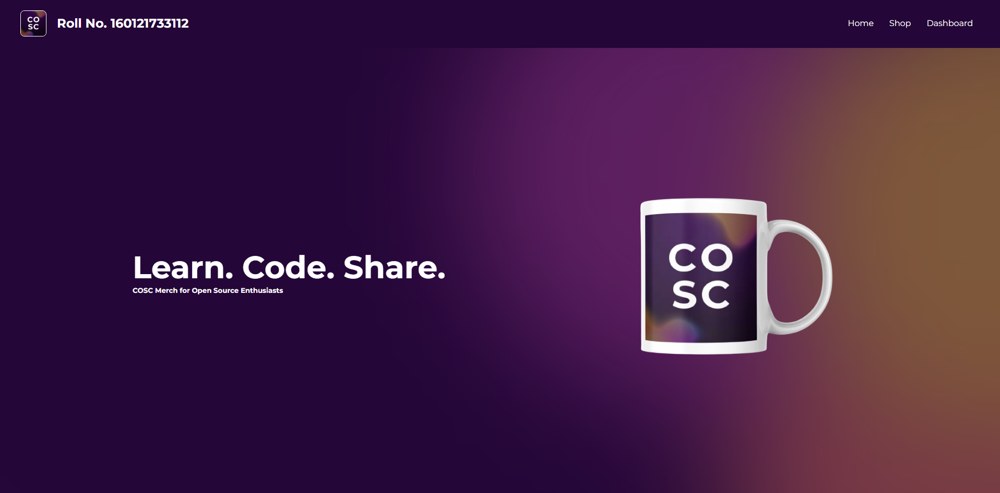
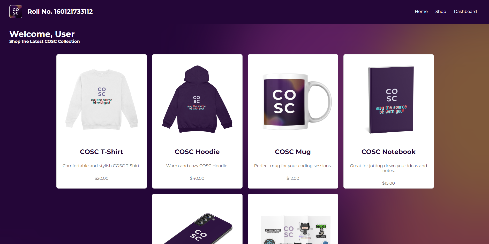
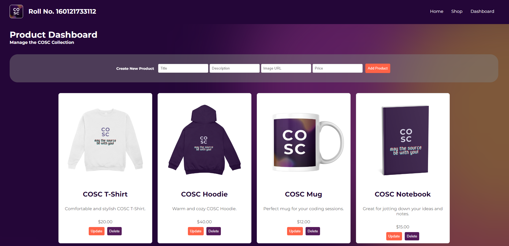

# Assignment 3: COSC Merchandise Store

## Objectives

-   Implement **Data Fetching** in React by successfully perform GET requests to retrieve and display data on the frontend using React.js.
-   Enforce **Data Validation** with FastAPI through defining and applying Pydantic models in FastAPI.
-   Gain a holistic understanding of **CRUD Functionality** in FastAPI and implement the DELETE and READ endpoints in FastAPI to allow for proper data management through the backend.
-   Enhance **Frontend UI** by displaying important user information.

## Overview

In this assignment, you will enhance a partially built web application by adding essential functionalities to both the frontend (React.js) and backend (FastAPI). Your tasks include implementing key features like data fetching, CRUD operations, and data validation, which are currently missing or incomplete. These enhancements will bring the application to a fully functional state, allowing seamless interaction between the user interface and the backend, and ensuring data integrity and a better user experience.

<details open>
<summary><h2>Tasks</h2></summary>
<br>

<ul>
<li>
<h3>Repository Setup:</h3>

Download or clone the repository and work on the assigned tasks. Ensure that all modifications are made within the provided files.

https://github.com/user-attachments/assets/ef43aa31-4932-4693-bf26-ebf4a0638dc1

-   [Click here](https://github.com/cbitosc/ReactJS-and-FastAPI-Bootcamp-Assignments/archive/refs/heads/main.zip) to download the zip file of the assignments.
-   Extract the repository once it is downloaded.
-   Open Visual Studio Code and open the Assignment-3 folder in it.

Once your folder is open in VS Code, open a new terminal and make sure you are in the Assignment-3 directory. Then, run frontend and backend in separate terminals:

### Running the frontend server

-   Open a new terminal and navigate to frontend directory

    ```
    cd frontend
    ```

-   Install the required packages using npm install command

    ```
    npm install
    ```

-   Subsequently, start the development server using the npm run dev command

    ```
    npm run dev
    ```

### Running the backend server

-   Open **another new terminal** and navigate to backend directory

    ```
    cd backend
    ```

-   Install the required packages using pip install command

    For Windows

    ```
    pip install -r requirements.txt
    ```

    For Linux/Mac

    ```
    pip3 install -r requirements.txt
    ```

-   Subsequently, start the development server using the uvicorn command

    For Windows

    ```
    python -m uvicorn main:app --reload
    ```

    For Linux/Mac

    ```
    python3 -m uvicorn main:app --reload
    ```

</li>

<li><h3>1. Display Roll Number:</h3> Add a hardcoded roll number to the **Navbar.js** component and ensure it is displayed prominently.</li>
<li><h3>2. Implement Read Functionality:</h3>

-   **2.1**: Add functionality to the the GET /products/ endpoint in FastAPI to return a list of all products.
-   **2.2**: Utilize a GET request in React to fetch and display all product data on the Shop page.

</li>
<li><h3>3. Define Pydantic Models for Data Validation:</h3>

-   **3.1**: Create a ProductBase model in FastAPI with the fields `title`, `description`, `imageUrl`, and `price`, all as strings.
-   **3.2**: Use the ProductBase model to define the types for the product parameter in the create and update API endpoints.
</li>

<li><h3>4. Implement Delete Functionality: </h3>

-   **4.1**: Add the delete operation to the `DELETE /products/{product_id}` endpoint in main.py.
-   **4.2**: After deleting a product, re-fetch the product list on the frontend to update the display.
</li>
</ul>
</details>

<hr>

<details>
<summary><h2>Expected outputs</h2></summary>
<p align="center">
  
  
  
</p>
</details>

<hr>

<details>
<summary><h2>Submission Process</h2></summary>
<br>
<ul>
<li><h3>1. Test Your Application:</h3>

Ensure that each feature in your application is implemented correctly and functions as expected. Verify that the Roll Number displays in the Navbar, and that routing to the Temperature Conversion page works seamlessly. Test the Calculator to confirm that values are appended correctly, results are computed accurately, and updates occur automatically. Similarly, validate the Temperature Converter to ensure that unit selections, conversions, and automatic updates are handled correctly. Thoroughly test the entire application to confirm that all tasks are functioning smoothly.</li>

<li><h3>2. Submit Completed Code:</h3>

Go to <a href="https://drive.google.com/drive/folders/1F6lGfqkjZzu5s9hhQpbSH6gM4a5vCiGF?usp=drive_link">this link</a> and upload your **src** folder, **main.py** file and output screenshots to the folder named after your roll number.</li>

<li><h3>3. Finish The Task:</h3>

Fill <a href="https://forms.gle/2Fiv3eRcJcxFSw5x6">this Google Form</a> to finish the task.</li>

</ul>
</details>

## Deadline

**22 August 2024**

By completing this assignment, you will gain experience in enhancing forms, handling form submissions, and making basic UI design adjustments. And as always, may the source be with you!
